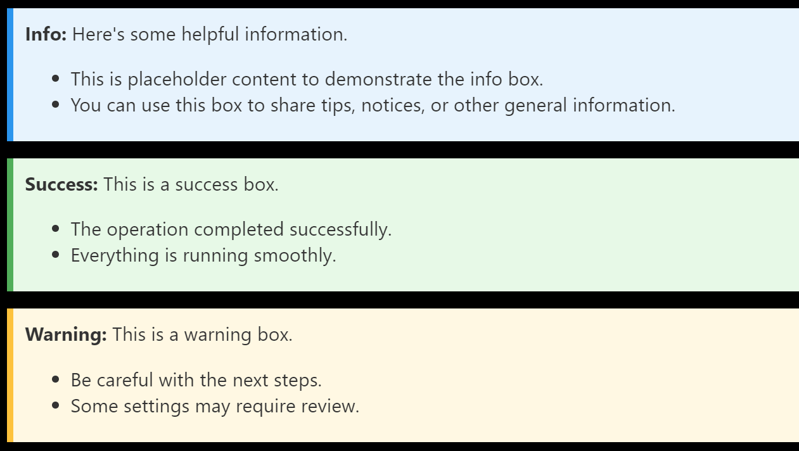

# Contributing to 3lc-examples

Thank you for your interest in contributing to our collection of tutorial notebooks! We welcome contributions from the community to enhance and expand our repository. Below are the guidelines to help you contribute effectively.

## General Principles

- **Notebook Structure**: Each notebook should include:
  - A descriptive title and a corresponding link & screenshot in the README.
  - A short description of its purpose and prerequisites.
  - After the title and the description, always include the following H2 subsections:
    - `Imports`
    - `Project Setup`
  - Additional H2 subsections as needed
  - When relevant, a final subsection with "Suggested next steps", formatted as a bullet-point list (`*`). This could include other notebooks to explore, workflows to try in the 3LC Dashboard, or other resources.

- **Imports**:
  - Imports should be grouped in a single cell at the top of the notebook.
  - This ensures early failure if dependencies are missing and provides clarity about required libraries.
  - Ensure any transient optional dependencies are explicitly imported to avoid late failures.

- **Sanity Checks**:
  - After loading any data (e.g., from `/data`), perform basic sanity checks to verify correctness. This allows users to drop-in replace data/tables and run the notebook without issues.

- **No Output on Check-in**:
  - Notebooks must be saved without cell outputs before committing them to the repository.

- **Code-Specific Notes**:
  - In some cases, e.g. when showcasing how to add 3LC to a standard training workflow in a given framework, annotate 3LC-specific code with the decorator pattern below. This helps users understand what is unique to 3LC and what is standard practice in the given framework.

    ```python
    ################## 3LC ##################
    < your code here>
    #########################################
    ```

- **Data Attribution**:
  - If adding new data to the `/data` directory, make sure to include proper attributions.

- **Type Annotations**:
  - Avoid type hints in notebooks unless they use 3LC-specific types where code-completion/reference docs will be useful.

- **Code Comments**:
  - Be liberal about adding comments to explain the code and its purpose. Use markdown cells for longer explanations.

- **Info Boxes**:
  - Use HTML in markdown cells to create nice colorful info boxes for important notes or warnings. E.g.

  ```html
  <div style="background-color: #e7f3fe; padding: 10px; border-left: 6px solid #2196F3; margin-bottom: 15px; color: #333;">
      <strong>Info:</strong> Here's some helpful information.
      <ul>
          <li>This is placeholder content to demonstrate the info box.</li>
          <li>You can use this box to share tips, notices, or other general information.</li>
      </ul>
  </div>

  <div style="background-color: #e6f9e6; padding: 10px; border-left: 6px solid #4CAF50; margin-bottom: 15px; color: #333;">
      <strong>Success:</strong> This is a success box.
      <ul>
          <li>The operation completed successfully.</li>
          <li>Everything is running smoothly.</li>
      </ul>
  </div>

  <div style="background-color: #fff8e1; padding: 10px; border-left: 6px solid #FFC107; margin-bottom: 15px; color: #333;">
      <strong>Warning:</strong> This is a warning box.
      <ul>
          <li>Be careful with the next steps.</li>
          <li>Some settings may require review.</li>
      </ul>
  </div>
  ```

  Which results in boxes like:
  

## Getting Started with Contributions

1. **Fork and Clone the Repository**:
   - Fork the repository to your account and clone it locally.

2. **Set Up Your Environment**:
   - Install the required dependencies and the development dependencies.

3. **Follow the Notebook Guidelines**:
   - Use the principles above to create or edit a notebook.

4. **Test Your Changes**:
   - Ensure the notebook runs from top to bottom without errors and follows the structured flow.

5. **Submit a Pull Request**:
   - Provide a clear description of the changes you've made.
   - Mention the purpose of the notebook or the specific improvements you've implemented.

## Reviewing Process

- We aim to review pull requests promptly.

## Thank You

We appreciate your contributions and look forward to growing this project with your help. If you have any questions or suggestions, feel free to open an issue or start a discussion!
