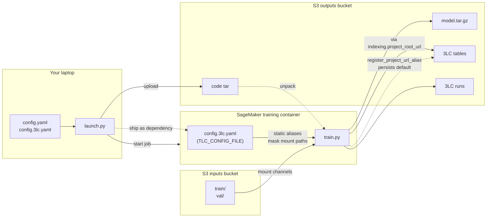
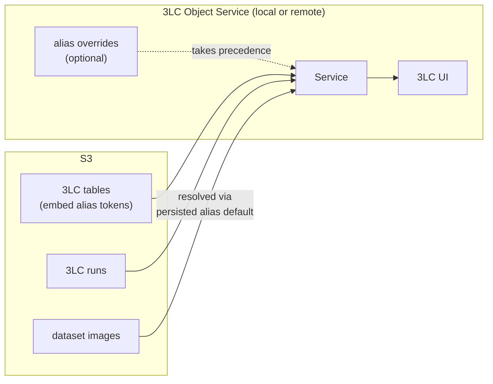

# 3LC on SageMaker — Remote Training Template

A working reference for running [3LC](https://3lc.ai)–instrumented training
jobs on SageMaker with every 3LC artifact (tables, runs, URL aliases) living
in S3. Fork it, swap the balloons-detection bits for your model + dataset,
and you have a production-shaped remote training pipeline.

## Why this template exists

Running 3LC locally is easy. Running 3LC **remotely**, with data in S3 and
tables/runs that must outlive the container, is subtly hard. The config is
small but several independent things each have to be right:

1. **The 3LC config file must reach the container.** `TLC_CONFIG_FILE` has
   to point at its **in-container** path, not the path on your laptop.
2. **URL aliases have two different jobs, done in two different places.**
   *Static* aliases in `config.3lc.yaml` mask the SageMaker mount points
   (`/opt/ml/input/data`, `/opt/ml/model`) so those ephemeral paths never
   get embedded in serialized tables. *Project-persisted* aliases
   (`tlc.register_project_url_alias` from `train.py`) give those tokens a
   default resolution target on S3, so future readers (the 3LC UI, the
   Object Service, downstream jobs) can actually open the tables later.
   Getting one without the other leaves you with unresolvable tokens or
   container paths leaking into your artifacts.
3. **3LC tables and runs must materialize on S3,** not in the container's
   ephemeral filesystem. That's driven by 3LC's `indexing.project_root_url`
   (in `config.3lc.yaml`), not by any SageMaker setting. Aliases are a
   *separate* concern — they govern how paths are *referred to*, not where
   objects are created.

Each of these is one wrong line away from a confusing failure. This
template encodes the right answer for each, at the right spot in the code.

---

## Project layout

```
launch.py                   # run on your laptop — orchestrates the job
config.example.yaml         # template → copy to config.yaml (gitignored)
config.3lc.example.yaml     # template → copy to config.3lc.yaml (gitignored)
pyproject.toml              # laptop deps (managed by uv)
src/
├── train.py                # runs inside the training container
└── requirements.txt        # container deps installed before train.py starts
```

Two mental models:

- **`launch.py`** runs on your laptop. Loads `config.yaml`, builds a
  `sagemaker.pytorch.PyTorch` estimator, calls `.fit()`.
- **`src/train.py`** runs inside the SageMaker container. Reads
  hyperparameters from CLI, channel paths from `SM_CHANNEL_*`, creates 3LC
  tables with URL aliases, trains, saves to `SM_MODEL_DIR`.

### Training-time flow



---

## 1. One-time AWS setup

### IAM role for SageMaker

Create an IAM role SageMaker assumes. You'll paste its ARN into `config.yaml`.

1. IAM → Roles → Create role → **AWS service → SageMaker**. AWS attaches
   `AmazonSageMakerFullAccess` by default; leave it.
2. Attach a policy granting access to your buckets:

    ```json
    {
      "Version": "2012-10-17",
      "Statement": [
        {
          "Effect": "Allow",
          "Action": ["s3:GetObject", "s3:ListBucket"],
          "Resource": [
            "arn:aws:s3:::<your-inputs-bucket>",
            "arn:aws:s3:::<your-inputs-bucket>/*"
          ]
        },
        {
          "Effect": "Allow",
          "Action": ["s3:PutObject", "s3:GetObject", "s3:ListBucket"],
          "Resource": [
            "arn:aws:s3:::<your-outputs-bucket>",
            "arn:aws:s3:::<your-outputs-bucket>/*"
          ]
        }
      ]
    }
    ```

   Collapse to one statement if inputs and outputs share a bucket.
3. Copy the role ARN.

### Local tooling

```bash
uv sync
```

AWS credentials must be resolvable by boto3 (`~/.aws/credentials`, SSO,
`AWS_PROFILE`, instance profile). You can also set `aws.profile` in
`config.yaml` to pick a named profile explicitly.

For `--local` mode: Docker Desktop (or Colima / OrbStack). Apple Silicon
users: see the note at the bottom + uncomment `polars[rtcompat]` in
`src/requirements.txt`.

---

## 2. Configure

```bash
cp config.example.yaml   config.yaml
cp config.3lc.example.yaml config.3lc.yaml
```

Fill in `config.yaml`:
- `aws.region`, `aws.role_arn`, optionally `aws.profile`
- `s3.inputs_bucket` + `inputs_prefix` (where your dataset lives)
- `s3.outputs_bucket` + `outputs_prefix` (model + 3LC artifacts go here;
  can be the same bucket as inputs)
- `hyperparameters.project` — your 3LC project name

Fill in `config.3lc.yaml` with 3LC settings. For tables and runs to land
on S3, set `indexing.project_root_url` to `s3://<outputs_bucket>/<outputs_prefix>`.
See the file itself for the distinction between that and `aliases:`.

Both files are gitignored.

---

## 3. Dataset layout

The template expects a COCO-style dataset under
`s3://<inputs_bucket>/<inputs_prefix>/`:

```
train/
  train-annotations.json
  <image files>
val/
  val-annotations.json
  <image files>
```

`launch.py` mounts `.../train/` and `.../val/` as **separate** SageMaker
channels, visible inside the container as `/opt/ml/input/data/train` and
`/opt/ml/input/data/val`. Each mount's original S3 URI is forwarded as
`TRAIN_S3_URI` / `VAL_S3_URI` — `train.py` reads these to persist
project-level URL aliases (the default resolution target for future
readers, see §6).

Customize the layout by editing `create_tables()` in `src/train.py` and
`channel_s3_uris()` in `launch.py`.

---

## 4. Run

Local smoke test (Docker, no SageMaker cost):

```bash
uv run launch.py --local
```

Remote:

```bash
uv run launch.py
```

The SDK re-tars `src/` on every call — edits to `train.py` are picked up
with no rebuild. Watch logs in the SageMaker console or:

```bash
aws logs tail /aws/sagemaker/TrainingJobs --follow
```

---

## 5. What lands where on S3

After a successful run:

| Artifact                            | S3 path                                                                      |
|-------------------------------------|------------------------------------------------------------------------------|
| Source code tar                     | `s3://<out>/<prefix>/code/<job>/source/sourcedir.tar.gz`                     |
| Model artifact (`SM_MODEL_DIR`)     | `s3://<out>/<prefix>/models/<job>/output/model.tar.gz`                       |
| 3LC tables                          | `s3://<out>/projects/<project>/datasets/<dataset>/tables/...`                |
| 3LC runs                            | `s3://<out>/projects/<project>/runs/...`                                     |

Exact 3LC paths depend on `indexing.project_root_url` in your
`config.3lc.yaml`; the paths above assume it's set to `s3://<out>/projects`.

Which alias tokens end up in the serialized tables is driven by the
static aliases in `config.3lc.yaml` (e.g. `SM_INPUT: /opt/ml/input/data`).
The runtime `register_project_url_alias` calls in `create_tables` do
something different — see the next section.

---

## 6. Using the artifacts afterwards

3LC tables and runs now live on S3 — but you don't browse S3 directly.
You point a **3LC Object Service** (local on your laptop, or deployed
remotely and shared) at the project; the service resolves the alias
tokens inside the tables and serves data to the 3LC UI.

Alias resolution order:

1. Alias overrides configured on the object service itself (highest)
2. Aliases persisted into the project on S3 (what `register_project_url_alias`
   writes from `create_tables`)



Out of the box, #2 takes effect: the tokens we persisted at training time
(`SM_TRAIN_INPUT_DATA`, `SM_VAL_INPUT_DATA`) resolve to their original
S3 URIs, so images load straight from S3. No extra config needed.

**When you'd use an override:** if the object service runs on a machine
that already has a faster local copy of the data (e.g. a shared GPU box
with the dataset rsynced for low-latency access), override the alias in
the service config:

```yaml
# object service config (laptop or remote)
aliases:
  SM_TRAIN_INPUT_DATA: /mnt/datasets/balloons/train
  SM_VAL_INPUT_DATA:   /mnt/datasets/balloons/val
```

Now paths resolve to the local copy instead of round-tripping to S3.
The persisted S3 default still applies for anyone else viewing the
project through a different service.

This is what the `register_project_url_alias` work in `create_tables`
buys you: a sensible S3 default for everyone, overridable per-service
when there's a reason.

---

## 7. Cloning this as a starter for another project

Grep for `CUSTOMIZE:` — every spot you actually need to touch is marked.

At minimum:
1. `config.yaml` — bucket names, role ARN, region, `hyperparameters.project`
2. `src/train.py:create_tables()` — `dataset_name`, annotations filenames,
   any task-specific table setup
3. `src/train.py:main()` — the YOLO block → your model + framework call
4. `src/requirements.txt` — container deps for the new training code
5. `config.3lc.yaml` — 3LC aliases/overrides

Things you should **not** need to touch:
- SageMaker plumbing in `launch.py` (channels, env vars, code/output paths)
- The `TLC_CONFIG_FILE` wiring
- The URL alias pattern (`register_project_url_alias` calls)

---

## Hyperparameters

Defined in `config.yaml` under `hyperparameters:`, arrive in `train.py` as
CLI args. Visible in the SageMaker console's job metadata.

| Key           | Type | Purpose                                                                 |
|---------------|------|-------------------------------------------------------------------------|
| `epochs`      | int  | YOLO epochs                                                             |
| `batch_size`  | int  | YOLO batch size                                                         |
| `project`     | str  | 3LC project name                                                        |
| `device`      | str  | `cpu` for local, `"0"` or `"cuda"` for GPU instances                    |
| `use_latest`  | bool | Follow each 3LC table to its latest revision before training            |

For bool hyperparameters: SageMaker serializes all hyperparameters as
strings, so use a string→bool coercer in argparse (`--use_latest` shows
the pattern), not `action="store_true"`.

---

## Env vars

Set under `env:` in `config.yaml`. Reserve for **secrets** — everything
else should be a hyperparameter (visible in job metadata, searchable in
SageMaker console).

| Var            | Set by        | Used by                                                     |
|----------------|---------------|-------------------------------------------------------------|
| `TLC_API_KEY`  | you           | 3LC, at runtime                                             |
| `OUTPUTS_BUCKET` / `OUTPUTS_PREFIX` | launch.py | `train.py`, for anything writing directly to S3 |
| `TRAIN_S3_URI` / `VAL_S3_URI`       | launch.py | `train.py`, for URL alias registration          |
| `TLC_CONFIG_FILE` | launch.py (if `config.3lc.yaml` exists) | `tlc` library, on import       |

---

## Apple Silicon note

SageMaker's local mode runs x86_64 Linux containers. On Apple Silicon
Macs these run under Rosetta 2 / QEMU emulation — functional but slow
(often 10×+ slower than a real x86 box). Fine for proving the data path
end-to-end; not fine for real training iteration.

1. Docker Desktop → Settings → General → enable **"Use Rosetta for
   x86_64/amd64 emulation on Apple Silicon"**.
2. Uncomment `polars[rtcompat]` in `src/requirements.txt`. Default polars
   uses AVX/AVX2 SIMD, which Rosetta doesn't emulate — it SIGILLs on the
   first dataframe op. `polars[rtcompat]` is the SIMD-free build.

---

## Extending

- **Spot instances / checkpointing**: three extra kwargs on the
  `PyTorch(...)` estimator in `launch.py` — `use_spot_instances`,
  `max_wait`, `checkpoint_s3_uri`. Intentionally skipped here for clarity.
- **Multi-GPU / distributed**: `instance_count`, `distribution`
  on the estimator; YOLO picks it up automatically from `device`.
- **Different framework**: swap the `sagemaker.pytorch.PyTorch` import
  for `TensorFlow` / `HuggingFace` / `SKLearn` — the rest of `launch.py`
  is framework-agnostic.
