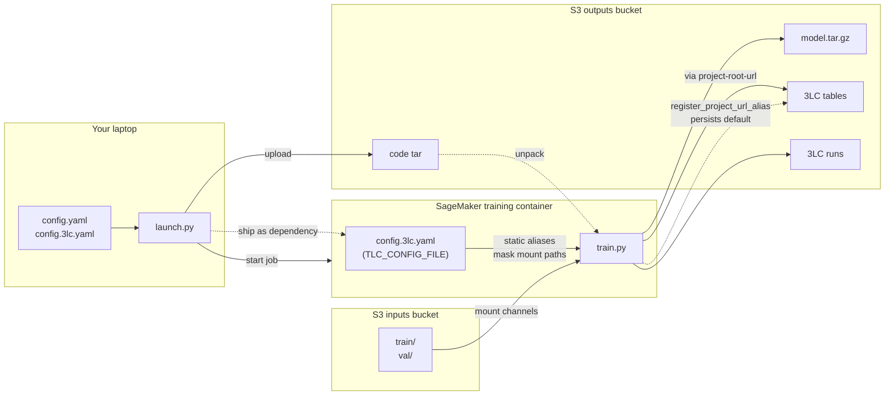
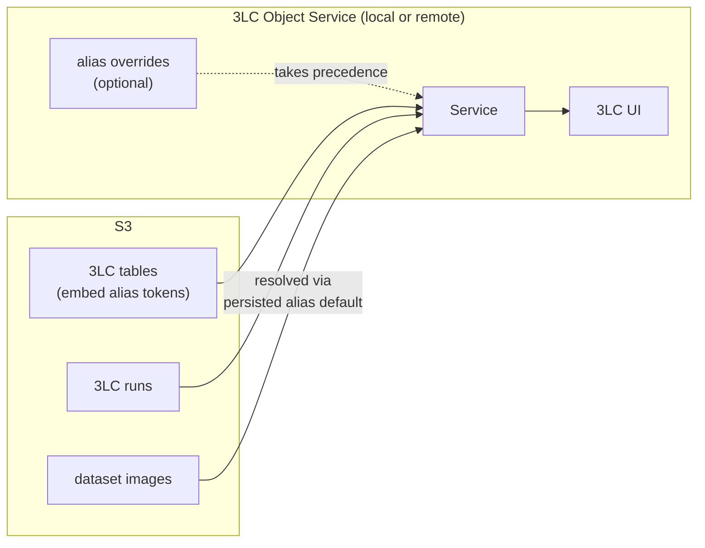

# 3LC on SageMaker — Remote Training Template

A working reference for running [3LC](https://3lc.ai)–instrumented training
jobs on SageMaker with every 3LC artifact (tables, runs, URL aliases)
living on S3. Fork it, swap the table-creation and training bits for
your model + dataset, and you have a production-shaped remote training
pipeline.

> **The point of this template is not SageMaker.** It's understanding
> how 3LC behaves when *data lives in one place, training runs in another,
> and viewing happens in a third*. SageMaker is a convenient stand-in
> for that topology. The three concepts that matter — **aliases**,
> **`project-root-url`**, and **shipping the 3LC config to the
> trainer** — apply to any setup with the same shape (Vertex AI,
> Kubernetes jobs, an HPC cluster, your colleague's GPU box).

## What's actually 3LC-specific?

Surprisingly little. Every 3LC-specific line in this template is one of:

| Where                          | What                                                        |
|--------------------------------|-------------------------------------------------------------|
| `config.3lc.yaml`              | The whole file (aliases, `project-root-url`)                |
| `launch.py` (`dependencies` + `TLC_CONFIG_FILE` block) | Ship `config.3lc.yaml` into the container, set `TLC_CONFIG_FILE` |
| `launch.py`, `TRAIN_S3_URI` / `VAL_S3_URI` env vars | Forward S3 source URIs so `train.py` can register aliases |
| `src/train.py`                 | One `import tlc`, one `setup_project_aliases()` call — fenced with `# 3LC` |
| `src/tasks/<name>/task.py`     | `tlc.Table.from_*` for table creation; pick a 3LC-aware trainer (e.g. `tlc_ultralytics`) |
| `src/requirements.txt`         | The 3LC-aware framework (`3lc-ultralytics` here)            |

Everything else (channels, role, output paths, hyperparameters, the
training loop scaffolding) is plain SageMaker. The dispatcher in
`train.py` is framework-agnostic — strip 3LC and you'd still have a
working SageMaker task-dispatcher template.

## The three concepts

1. **`project-root-url` decides *where* tables and runs are
   created.** Set it to `s3://...` and your artifacts outlive the
   container. This is in `config.3lc.yaml`.

2. **Static aliases (in `config.3lc.yaml`) decide *what gets embedded*
   when serializing tables.** They're path-prefix tokens that mask
   the ephemeral channel mount points (`/opt/ml/input/data/train`,
   `/opt/ml/input/data/val`) so those don't leak into stored artifacts.

3. **Project-persisted aliases (`tlc.register_project_url_alias`)
   decide *how those tokens resolve later*.** They give future readers
   (the 3LC UI, downstream jobs, the Object Service) a default target
   for whichever tokens your tables embedded.

(2) and (3) operate on the same alias names but in opposite directions
(serialize vs resolve), which is why they're easy to confuse. Getting
one without the other leaves you with unresolvable tokens or container
paths leaking into artifacts.

The "shipping" detail: `TLC_CONFIG_FILE` must point at the
**in-container** path of `config.3lc.yaml`, not the path on your
laptop. `launch.py` adds the file to `dependencies` and sets the env
var to `/opt/ml/code/config.3lc.yaml`.

---

## Project layout

```
launch.py                              # laptop — orchestrates the job
config.example.yaml                    # template → copy to config.yaml (gitignored)
config.3lc.example.yaml                # template → copy to config.3lc.yaml (gitignored)  ★ 3LC
pyproject.toml                         # laptop deps (managed by uv)
src/
├── train.py                           # container entry point — dispatcher (~10 lines of 3LC)
├── requirements.txt                   # container deps installed before train.py starts
└── tasks/                             # one folder per task — what you swap when forking
    ├── balloons_yolo/                 # Mode A native (build tables in-job from raw COCO)
    │   ├── __init__.py                #   re-exports build_tables, train
    │   └── task.py                    #   build_tables() + train()
    └── pyronear_yolo/                 # Mode B native (load tables seeded out-of-job)
        ├── __init__.py                #   re-exports build_tables, train
        ├── task.py                    #   build_tables() + train()
        └── create_tables.py           #   laptop-only: seeds tables for this task
```

Mental model:

- **`launch.py`** runs on your laptop. Loads `config.yaml`, builds a
  `sagemaker.pytorch.PyTorch` estimator, calls `.fit()`.
- **`src/train.py`** runs inside the SageMaker container. It's a thin
  dispatcher: SageMaker plumbing + 3LC integration + `import_module`
  of the task picked by the `task` hyperparameter.
- **`src/tasks/<name>/`** is the per-task package. Its `__init__.py`
  re-exports `build_tables(args)` and `train(args, tables)` from
  `task.py`. This is the only place that's task-specific.
- **`src/tasks/<name>/create_tables.py`** (optional) seeds 3LC tables
  out-of-job for Mode B tasks. Runs on the laptop, not in the container.

### Training-time flow



---

## 1. One-time AWS setup

### IAM role for SageMaker

Create an IAM role SageMaker assumes. You'll paste its ARN into `config.yaml`.

1. IAM → Roles → Create role → **AWS service → SageMaker**. AWS attaches
   `AmazonSageMakerFullAccess` by default; leave it.
2. Attach a policy granting access to your buckets:

    ```json
    {
      "Version": "2012-10-17",
      "Statement": [
        {
          "Effect": "Allow",
          "Action": ["s3:GetObject", "s3:ListBucket"],
          "Resource": [
            "arn:aws:s3:::<your-inputs-bucket>",
            "arn:aws:s3:::<your-inputs-bucket>/*"
          ]
        },
        {
          "Effect": "Allow",
          "Action": ["s3:PutObject", "s3:GetObject", "s3:ListBucket"],
          "Resource": [
            "arn:aws:s3:::<your-outputs-bucket>",
            "arn:aws:s3:::<your-outputs-bucket>/*"
          ]
        }
      ]
    }
    ```

   Collapse to one statement if inputs and outputs share a bucket.
3. Copy the role ARN.

### Local tooling

```bash
uv sync
```

AWS credentials must be resolvable by boto3 (`~/.aws/credentials`, SSO,
`AWS_PROFILE`, instance profile). You can also set `aws.profile` in
`config.yaml` to pick a named profile explicitly.

For `--local` mode: Docker Desktop (or Colima / OrbStack). Apple Silicon
users: see the note at the bottom + uncomment `polars[rtcompat]` in
`src/requirements.txt`.

---

## 2. Configure

```bash
cp config.example.yaml     config.yaml
cp config.3lc.example.yaml config.3lc.yaml
```

Fill in `config.yaml`:
- `aws.region`, `aws.role_arn`, optionally `aws.profile`
- `s3.inputs_bucket` + `inputs_prefix` (where your dataset lives)
- `s3.outputs_bucket` + `outputs_prefix` (model + 3LC artifacts go here;
  can be the same bucket as inputs)
- `hyperparameters.project` — your 3LC project name

Fill in `config.3lc.yaml`:
- `project-root-url: s3://<outputs_bucket>/<outputs_prefix>`
  so tables and runs land on S3.
- `aliases:` — see §"The three concepts" above and the file itself.

Both files are gitignored.

---

## 3. Tasks and table-creation strategies

### Tasks

A **task** is a Python package under `src/tasks/<name>/` that exposes:

```python
def build_tables(args) -> tuple[tlc.Table, tlc.Table]: ...
def train(args, train_table, val_table) -> None: ...
```

Convention: implement these in `task.py` and re-export them from
`__init__.py` with `from .task import build_tables, train`.

Pick which task runs by setting the `task` hyperparameter in
`config.yaml`. `train.py` is a tiny dispatcher — it imports
`tasks.<name>` and calls those two functions. Switching tasks is a
config change, not a code change.

Pre-seeded tasks:

| Task            | Native mode | Notes                                              |
|-----------------|-------------|----------------------------------------------------|
| `balloons_yolo` | A           | YOLO on a COCO-style dataset mounted from S3       |
| `pyronear_yolo` | B           | YOLO on the pyronear/pyro-sdis HuggingFace dataset |

### Table-creation strategies (modes)

Independent of which task you pick, tables can come from three places:

| Mode | Tables created…                       | Configure with                                              | When to use |
|------|---------------------------------------|-------------------------------------------------------------|-------------|
| **A** | by the training job, every run       | (default — leave `train_table_url` / `val_table_url` empty) | Stable datasets in S3, simple COCO/folder-style layouts |
| **B** | once, outside the training job        | Set `train_table_url` / `val_table_url` in `config.yaml`    | Iterating on labels in the 3LC UI between runs; data not in S3 (HuggingFace, etc.) |
| **C** | by an upstream pipeline you don't own | Set `train_table_url` / `val_table_url` to whatever URLs they give you | Data team owns the tables; your job just trains |

In Modes B/C, `train.py` skips `task.build_tables()` and calls
`tlc.Table.from_url(...)` instead. A task can be Mode-A-native (its
`build_tables()` does the work — `balloons_yolo` is the example here),
or Mode-B-native (its `build_tables()` raises and you're expected to
seed tables out-of-job — `pyronear_yolo` is the example).

> **Tables vs. image bytes — they don't have to live together.** A 3LC
> `Table` is lightweight metadata (rows, labels, schema, alias-tokenized
> image URLs); it can live on the S3 remote root and be reused/edited
> across runs. The **image bytes** are separate, and the training loop
> has a stricter requirement than the dashboard:
>
> - **The dashboard / Object Service can stream images from S3** — it
>   resolves the alias token to `s3://...` and fetches on demand.
> - **The `tlc-ultralytics` trainer needs image bytes on a *local*
>   path.** It rejects an image URL that resolves to `s3://` (or any
>   non-local scheme) outright.
>
> So inside the container, whatever alias token the table embeds must
> resolve to a **local** directory:
>
> - **Mode A** gets this for free: the channel mounts the images at
>   `/opt/ml/input/data/...` and the static alias points there.
> - **Mode B/C** must arrange it: mount the image data as a channel and
>   add a static alias in `config.3lc.yaml` mapping the table's
>   bulk-data token to that mount (e.g. `PYRONEAR: /opt/ml/input/data/train`).
>   That static alias **overrides** the project-persisted S3 default for
>   this job only — the S3 default still serves the dashboard.

For Mode B, by convention the seeding script lives inside the task
package as `src/tasks/<task>/create_tables.py`. It runs on the laptop:

```bash
uv run python src/tasks/pyronear_yolo/create_tables.py
```

It prints the table URLs at the end — copy them into `config.yaml`
under `train_table_url` / `val_table_url`, then `uv run launch.py`.

### Dataset layout (Mode A only)

The default `balloons_yolo` task expects COCO-style under
`s3://<inputs_bucket>/<inputs_prefix>/`:

```
train/
  train-annotations.json
  <image files>
val/
  val-annotations.json
  <image files>
```

`launch.py` mounts `.../train/` and `.../val/` as **separate** SageMaker
channels, visible inside the container as `/opt/ml/input/data/train` and
`/opt/ml/input/data/val`. Customize the layout by editing the task's
`build_tables()` and (if mount points change) `channel_s3_uris()` in
`launch.py`.

In Mode B/C `build_tables()` is never called, but the channels still
matter: point them at the **image data** for the pre-built tables, so
the bytes land locally in the container (`/opt/ml/input/data/...`).
Then add a static alias in `config.3lc.yaml` mapping the table's
bulk-data token to that mount — see the "Tables vs. image bytes"
callout above. (If you only need to *index* the tables, not train on
them, the channels can point at any non-empty prefix — but then the
trainer has no local images to read.)

---

## 4. Run

Local smoke test (Docker, no SageMaker cost):

```bash
uv run launch.py --local
```

Remote:

```bash
uv run launch.py
```

The SDK re-tars `src/` on every call — edits to `train.py` are picked up
with no rebuild. Watch logs in the SageMaker console or:

```bash
aws logs tail /aws/sagemaker/TrainingJobs --follow
```

---

## 5. What lands where on S3

After a successful run:

| Artifact                            | S3 path                                                                      |
|-------------------------------------|------------------------------------------------------------------------------|
| Source code tar                     | `s3://<out>/<prefix>/code/<job>/source/sourcedir.tar.gz`                     |
| Model artifact (`SM_MODEL_DIR`)     | `s3://<out>/<prefix>/models/<job>/output/model.tar.gz`                       |
| 3LC tables                          | `<project-root-url>/projects/<project>/datasets/<dataset>/tables/...`        |
| 3LC runs                            | `<project-root-url>/projects/<project>/runs/...`                             |

The 3LC paths are driven by `project-root-url` in
`config.3lc.yaml`, *not* by SageMaker's `output_path`.

Which alias tokens end up *inside* the serialized tables is driven by
the static aliases in `config.3lc.yaml`. The runtime
`register_project_url_alias` calls in `setup_project_aliases()` do
something different — see the next section.

---

## 6. Using the artifacts afterwards

3LC tables and runs now live on S3 — but you don't browse S3 directly.
You point a **3LC Object Service** (local on your laptop, or deployed
remotely and shared) at the project; the service resolves the alias
tokens inside the tables and serves data to the 3LC UI.

### Pointing a service at the project

Any teammate who wants to view the project sets `scan-urls` in *their*
`config.3lc.yaml` to the S3 project root, then starts a service. This
`config.3lc.yaml` is unrelated to the one shipped into the training
container — it's the viewer's own local config.

```yaml
# viewer's config.3lc.yaml (laptop or shared box)
scan-urls:
  - s3://<outputs_bucket>/<outputs_prefix>
```

```bash
3lc service              # indexes the project root, serves the UI
# then open https://dashboard.3lc.ai
```

The runs and tables the SageMaker job wrote show up; opening one
streams the images. *How* they stream depends on alias resolution:

Alias resolution order:

1. Alias overrides configured on the object service itself (highest)
2. Aliases persisted into the project on S3 (what `setup_project_aliases`
   writes)



**Teammate A — no local copy of the data.** Out of the box, #2 takes
effect: the tokens persisted at training time (`SM_TRAIN_INPUT_DATA`,
`SM_VAL_INPUT_DATA`) resolve to their original S3 URIs, so images load
straight from S3. Just `scan-urls` + `3lc service` — no alias config
needed.

**Teammate B — has a faster local copy of the data.** If the service
runs on a machine that already has the dataset locally (e.g. a shared
GPU box with the data rsynced for low-latency access), add an alias
*override* alongside `scan-urls`:

```yaml
# Teammate B's config.3lc.yaml
scan-urls:
  - s3://<outputs_bucket>/<outputs_prefix>
aliases:
  SM_TRAIN_INPUT_DATA: /mnt/datasets/balloons/train
  SM_VAL_INPUT_DATA:   /mnt/datasets/balloons/val
```

Now paths resolve to the local copy instead of round-tripping to S3.
The persisted S3 default still applies for Teammate A, who views the
project through a different service.

This is what `setup_project_aliases()` buys you: a sensible S3 default
for everyone, overridable per-service when there's a reason.

---

## 7. Adding a task

The two places that change project-to-project are **table creation**
and **training**. Both live in `src/tasks/<name>/task.py`. Adding a
task is creating two files:

```python
# src/tasks/my_task/__init__.py
from .task import build_tables, train
```

```python
# src/tasks/my_task/task.py
import tlc
import my_framework  # or tlc-aware variant

def build_tables(args):
    # Mode A: build from raw data mounted at args.train / args.val.
    # Mode-B-only? raise NotImplementedError("see create_tables.py").
    return train_table, val_table

def train(args, train_table, val_table):
    ...  # your training loop; respect args.epochs, args.device, args.model_dir
```

Then in `config.yaml`:

```yaml
hyperparameters:
  task: my_task
```

For Mode B tasks, add a sibling `src/tasks/my_task/create_tables.py`
that runs on the laptop, writes the tables, and prints their URLs.
See `src/tasks/pyronear_yolo/create_tables.py` for the pattern.

Tasks can grow more files as needed (custom dataset classes,
label-mapping helpers, schema files) — they all live alongside
`task.py` in the same package.

Other things you'll usually touch:

1. `config.yaml` — bucket names, role ARN, region, `hyperparameters.project`.
2. `src/requirements.txt` — container deps for the new training code.
3. `config.3lc.yaml` — adjust aliases if your dataset uses different
   path conventions than the SageMaker mount points.

Things you should **not** need to touch:

- SageMaker plumbing in `launch.py` (channels, env vars, code/output paths)
- The `TLC_CONFIG_FILE` wiring
- `train.py` itself — the dispatcher, the 3LC integration, and the
  Mode-A-vs-Mode-B branching all stay
- `setup_project_aliases()` — the alias-name choices and the
  `register_project_url_alias` pattern travel with the template

### Task module dependencies

Importing a task imports its dependencies. If two tasks need
incompatible deps, either keep them in separate forks of the
template, or guard imports inside the functions (so only the
selected task's dependencies are pulled in at module import time).

---

## 3LC config

`config.3lc.yaml` has two blocks worth knowing:

```yaml
project-root-url: s3://<outputs_bucket>/<outputs_prefix>

aliases:
  SM_TRAIN_INPUT_DATA: /opt/ml/input/data/train
  SM_VAL_INPUT_DATA:   /opt/ml/input/data/val
```

(3.0 config syntax — keys are top-level and hyphenated. The 2.x
`indexing.project_root_url` form still loads via a deprecation remap
but emits a warning.)

- **`project-root-url`** — destination for new tables and runs.
- **`aliases`** — path-prefix substitutions applied when serializing
  paths in *this* job. Don't decide *where* anything is written;
  give paths a portable name. These names match the tokens
  `setup_project_aliases()` persists at runtime — see below.

Static aliases here live only in whichever process reads this file —
they mask paths locally but don't travel with the project. To make an
alias *persist into the project itself* (visible from the 3LC UI and
future jobs), call `tlc.register_project_url_alias(...)` at runtime —
that's `setup_project_aliases()` in `src/train.py`.

Full reference: <https://docs.3lc.ai/latest/configuration/>

---

## Hyperparameters

Defined in `config.yaml` under `hyperparameters:`, arrive in `train.py` as
CLI args. Visible in the SageMaker console's job metadata.

| Key                 | Type | Purpose                                                                 |
|---------------------|------|-------------------------------------------------------------------------|
| `task`              | str  | Module under `src/tasks/` to dispatch into                              |
| `epochs`            | int  | Training epochs (consumed by the task's `train()`)                       |
| `batch_size`        | int  | Batch size (consumed by the task's `train()`)                            |
| `workers`           | int  | Dataloader workers (consumed by the task's `train()`)                    |
| `project`           | str  | 3LC project name                                                        |
| `device`            | str  | `cpu` for local, `"0"` or `"cuda"` for GPU instances                    |
| `use_latest`        | bool | Follow each 3LC table to its latest revision before training            |
| `train_table_url`   | str  | Mode B/C: load existing train table by URL (skip `task.build_tables`)   |
| `val_table_url`     | str  | Mode B/C: load existing val table by URL (skip `task.build_tables`)     |

For bool hyperparameters: SageMaker serializes all hyperparameters as
strings, so use a string→bool coercer in argparse (`--use_latest` shows
the pattern), not `action="store_true"`.

---

## Env vars

Set under `env:` in `config.yaml`. Reserve for **secrets** — everything
else should be a hyperparameter (visible in job metadata, searchable in
SageMaker console).

| Var            | Set by        | Used by                                                     |
|----------------|---------------|-------------------------------------------------------------|
| `TLC_API_KEY`  | you           | 3LC, at runtime                                             |
| `TRAIN_S3_URI` / `VAL_S3_URI`       | launch.py | `train.py`, for URL alias registration          |
| `TLC_CONFIG_FILE` | launch.py (if `config.3lc.yaml` exists) | `tlc` library, on import       |

---

## Apple Silicon note

SageMaker's local mode runs x86_64 Linux containers. On Apple Silicon
Macs these run under Rosetta 2 / QEMU emulation — functional but slow
(often 10×+ slower than a real x86 box). Fine for proving the data path
end-to-end; not fine for real training iteration.

1. Docker Desktop → Settings → General → enable **"Use Rosetta for
   x86_64/amd64 emulation on Apple Silicon"**.
2. Uncomment `polars[rtcompat]` in `src/requirements.txt`. Default polars
   uses AVX/AVX2 SIMD, which Rosetta doesn't emulate — it SIGILLs on the
   first dataframe op. `polars[rtcompat]` is the SIMD-free build.

---

## Extending

- **Spot instances / checkpointing**: three extra kwargs on the
  `PyTorch(...)` estimator in `launch.py` — `use_spot_instances`,
  `max_wait`, `checkpoint_s3_uri`. Intentionally skipped here for clarity.
- **Multi-GPU / distributed**: `instance_count`, `distribution`
  on the estimator; YOLO picks it up automatically from `device`.
- **Different framework**: swap the `sagemaker.pytorch.PyTorch` import
  for `TensorFlow` / `HuggingFace` / `SKLearn` — the rest of `launch.py`
  is framework-agnostic.
