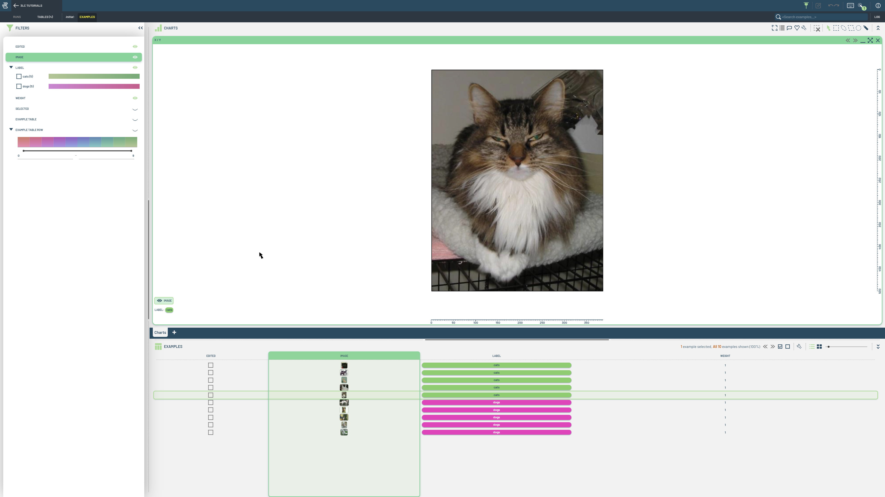
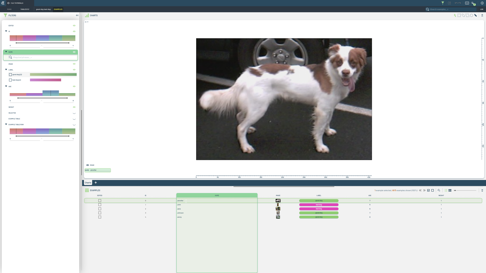
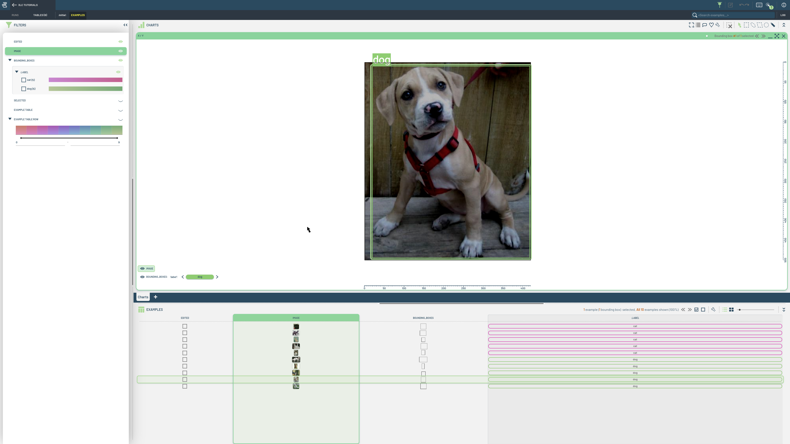
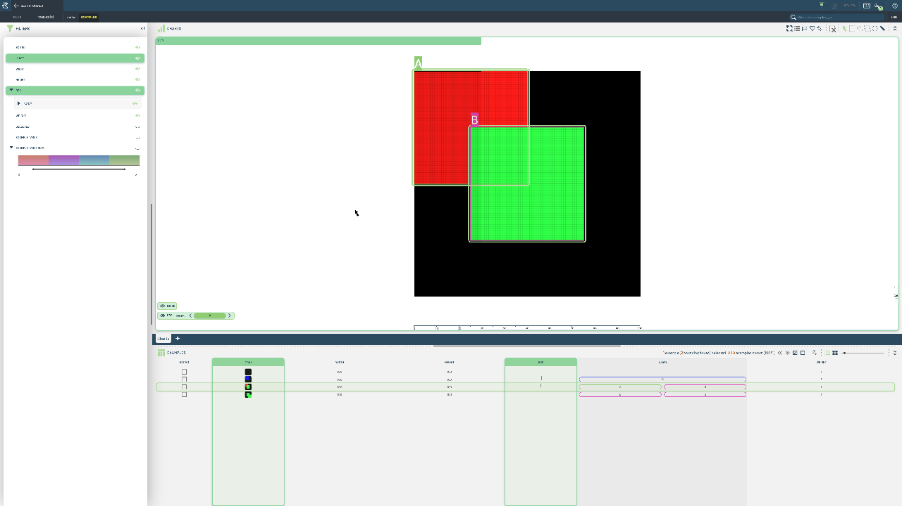
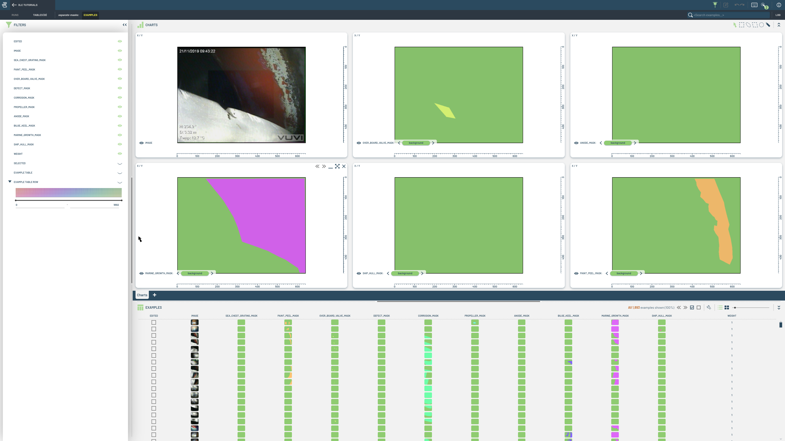
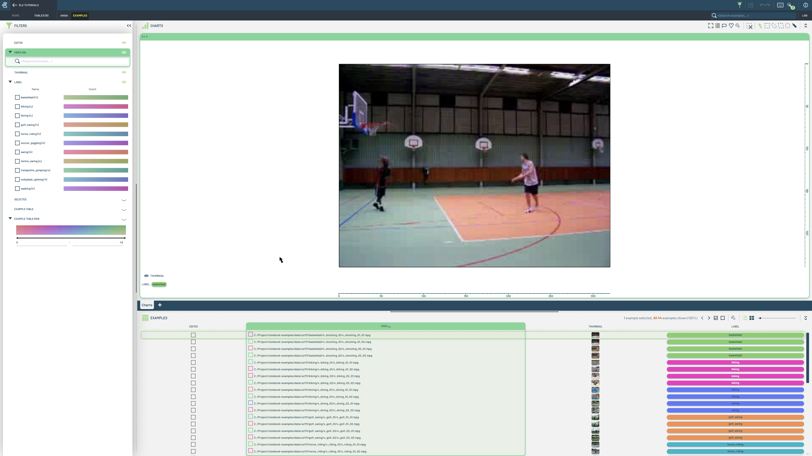

# Create 3LC Tables

This folder contains notebooks demonstrating how to create tables in 3LC.

| Image | Description |
|-------|-------------|
|  | Description for the first item, detailing the content or function associated with the clickable image. |
|  | Description for the first item, detailing the content or function associated with the clickable image. |
|  | Description for the first item, detailing the content or function associated with the clickable image. |
|  | Description for the first item, detailing the content or function associated with the clickable image. |
|  | Description for the first item, detailing the content or function associated with the clickable image. |
|  | Description for the first item, detailing the content or function associated with the clickable image. |
