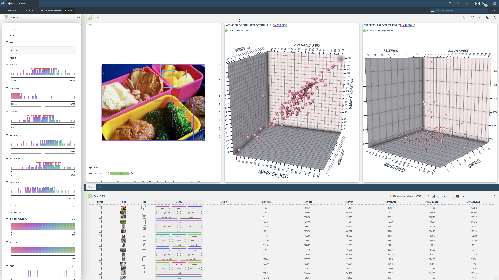
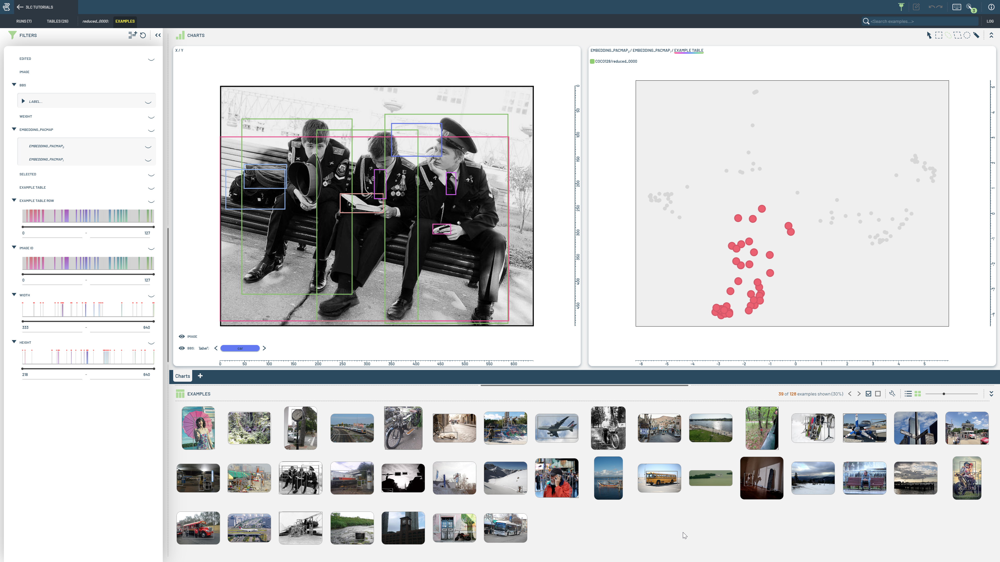
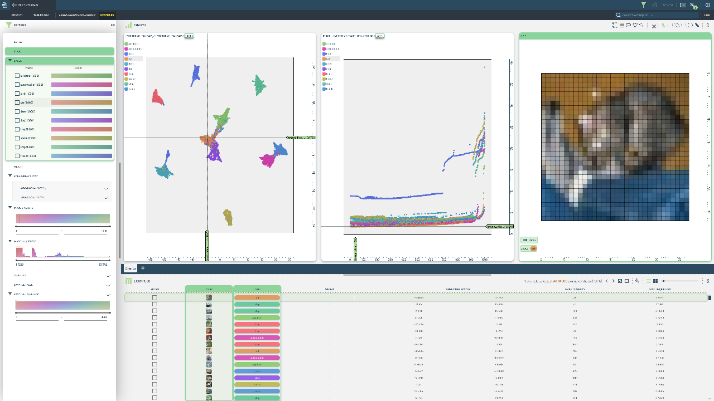

# Modify Tables

This folder contains notebooks demonstrating how to modify and extend data in 3LC, creating new tables inheriting from existing ones.

|  |  |  |
|:----------:|:----------:|:----------:|
| **Add Image Metrics** | **Add Embeddings** | **Add Classification Metrics** |
|  |  |  |
| This notebook covers adding image metrics such as brightness, sharpness, and contrast. |  This notebook demonstrates adding and reducing embeddings from a pre-trained model, allowing for advanced searches and similarity comparisons. | Explores adding the global image metrics "diversity" and "uniqueness", using pre-computed embedding and label columns. |
| **Split Tables** | **Add New Data** | **Add New Data and Split** |
|  |  |  |
| Learn to split tables into subsets based on conditions or sample splits for targeted processing. | This notebook focuses on adding new data entries, demonstrating how to expand datasets with fresh information. | This notebook provides two ways of adding new data to a dataset with existing split Tables. |
