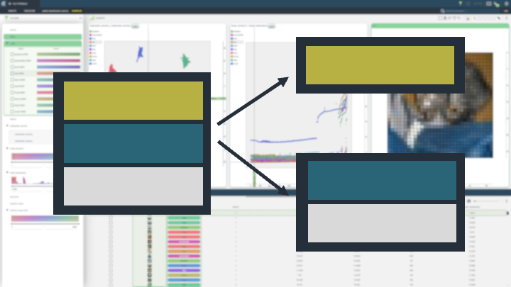
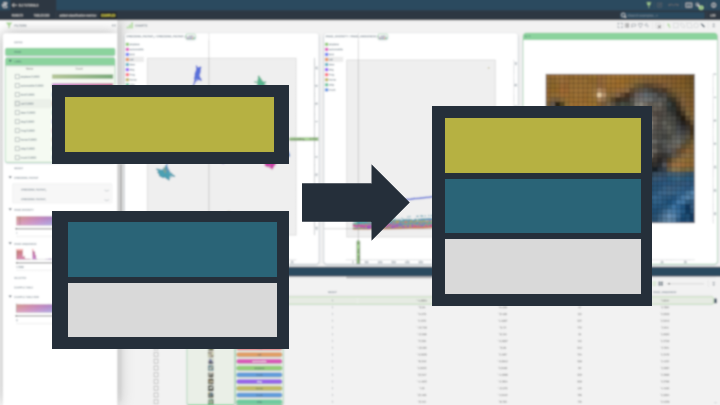
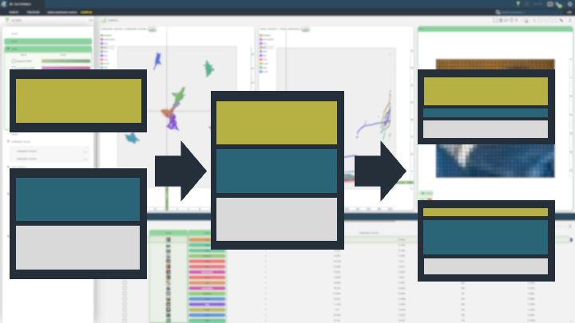
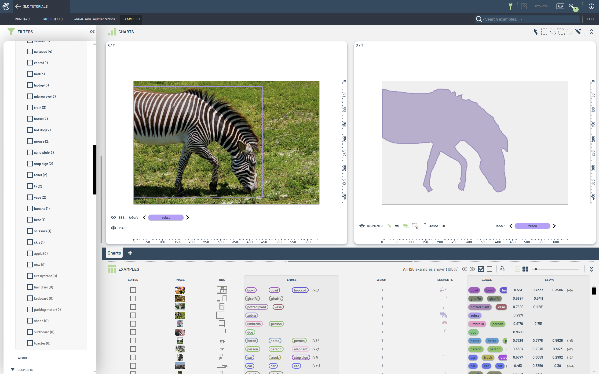

# Modify Tables

This folder contains notebooks demonstrating how to modify and extend data in 3LC, creating new Tables inheriting from existing ones.

|  |  |  |
|:----------:|:----------:|:----------:|
| **Add image metrics** | **Add embeddings** | **Add classification metrics** |
|  |  |  |
| This notebook covers adding image metrics such as brightness, sharpness, and contrast. |  This notebook demonstrates adding and reducing embeddings from a pre-trained model, allowing for advanced searches and similarity comparisons. | Explores adding the global image metrics "diversity" and "uniqueness", using pre-computed embedding and label columns. |
| **Split Tables** | **Add new data** | **Add new data and split** |
|  |  |  |
| Learn to split Tables into subsets based on conditions or sample splits for targeted processing. | This notebook focuses on adding new data entries, demonstrating how to expand datasets with fresh information. | This notebook provides two ways of adding new data to a dataset with existing split Tables. |
| **Convert bounding boxes to instance segmentation masks** | | |
|  | | |
| This notebook demonstrates how to convert bounding boxes to instance segmentation masks using the [SAM model](https://github.com/facebookresearch/segment-anything). | | |

