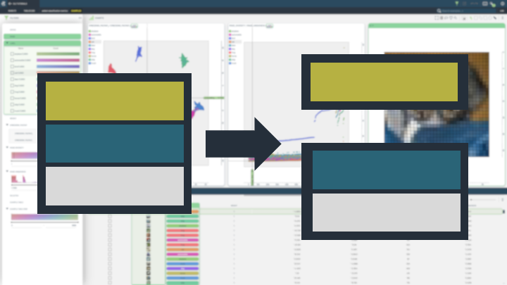

# Modify Tables

This folder contains notebooks demonstrating how to create modify and extend tables in 3LC.

Here’s a placeholder table for the specified notebooks, formatted with three columns per row:

|  |  |  |
|------------|------------|------------|
| Add Image Metrics | Add Embeddings | Add Global Image Metrics |
|    This notebook covers adding image metrics, showing how to compute and store metrics associated with each image. |    This notebook demonstrates adding embeddings, allowing for advanced searches and similarity comparisons. |    Explores adding global image metrics to enhance dataset-level analysis and aggregation. |
| Split Tables | Add New Data |  |
|    Learn to split tables into subsets based on conditions or sample splits for targeted processing. |    This notebook focuses on adding new data entries, demonstrating how to expand datasets with fresh information. |  |

Each cell includes:
- An image linked to the corresponding notebook.
- A brief description of each notebook’s content.

Replace `../images/*.png` with the appropriate image paths, and customize the descriptions if needed.