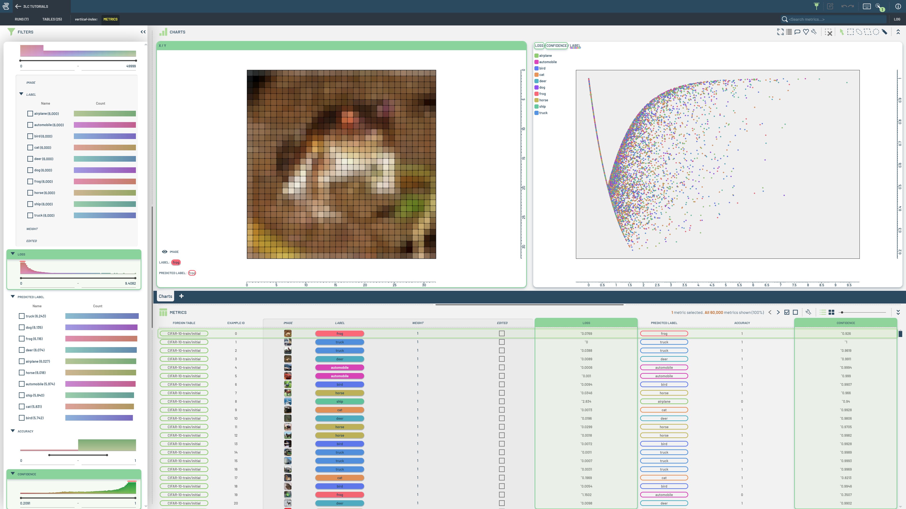
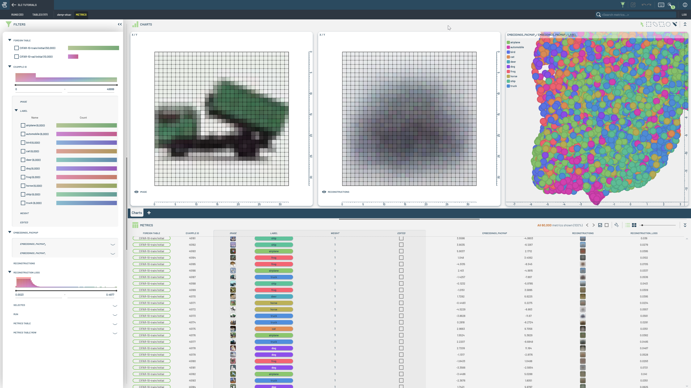

# Training and Metrics Collection

This folder contains notebooks demonstrating how to work with Runs and metrics in 3LC.

|  |  |  |
|:----------:|:----------:|:----------:|
| **Collect Metrics** | **SAM Embeddings** | **Dimensionality Reduction** |
|  |  |  |
| This notebook covers using a trained image classification model for metrics collection. Collects the metrics "predicted_label", "confidence", and "loss".| This notebook demonstrates extracting embeddings using the SAM model, and adding those embeddings to a Run. | Reduce dimensionality of embeddings in tables, using a single reduction model to transform several tables. |
| **Autoencoder** | | |
|  | |  |
| Train an autoencoder to use for embedding extraction. Collect image reconstructions and embeddings from the trained model. |  |  |
