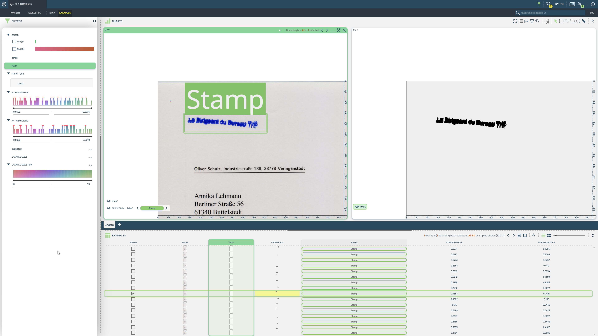
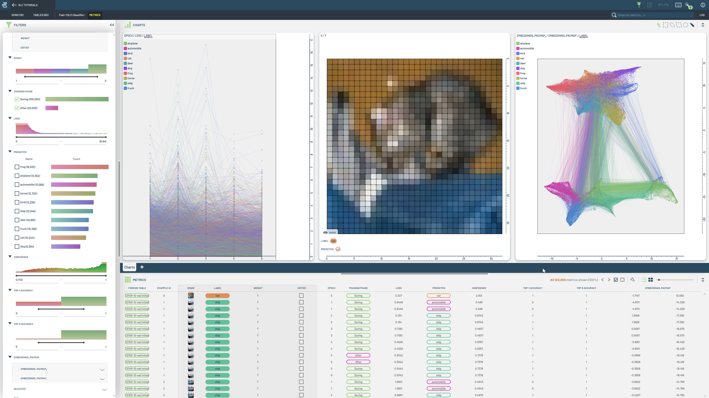

# Complete Examples

This folder contains notebooks showcasing complete examples of training and evaluation in 3LC.

|  |  |  |
|:----------:|:----------:|:----------:|
| **Hugging Face Segmentation** | **Fine-tune SAM** | **Train YOLO Classifier**  |
|  |  |  |
| This notebook demonstrates training a segmentation model using Hugging Face, including metrics collection and evaluation. | This notebook covers fine-tuning a model using SAM, showcasing the process and evaluation. | Train a YOLO classifier on existing 3LC Tables |
