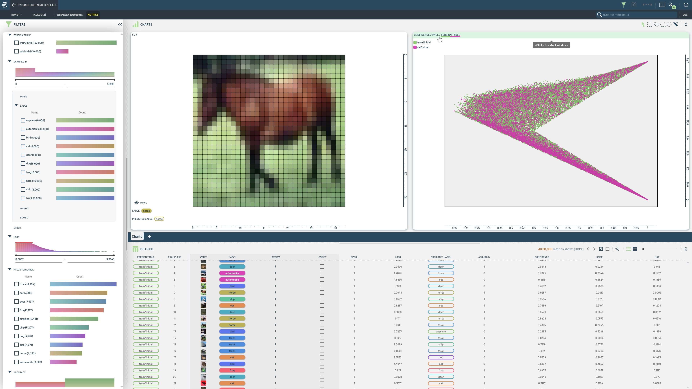
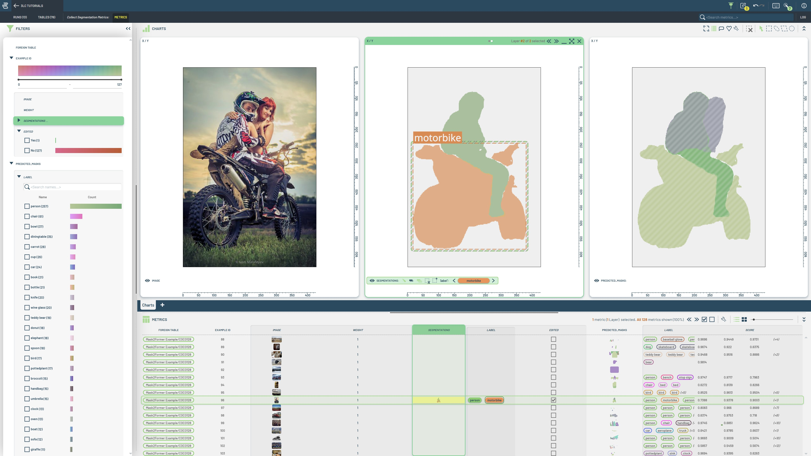
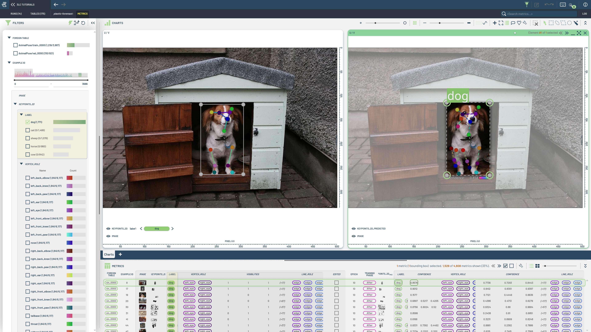
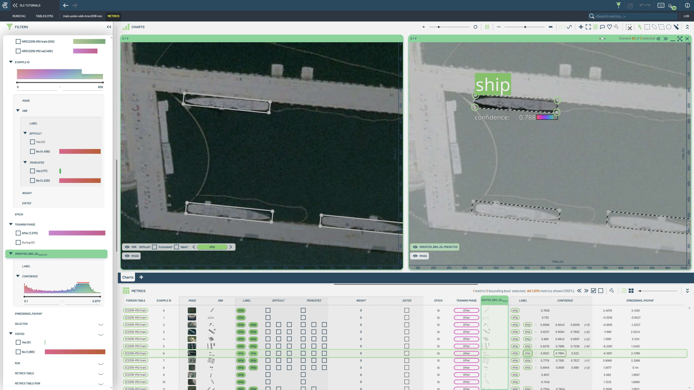

# Complete Examples

This folder contains notebooks showcasing complete examples of training and evaluation in 3LC.

|  |  |  |
|:----------:|:----------:|:----------:|
| **Hugging Face segmentation** | **Fine-tune SAM** | **Train YOLO classifier**  |
|  |  |  |
| This notebook demonstrates training a segmentation model using Hugging Face, including metrics collection and evaluation. | This notebook covers fine-tuning a model using SAM, showcasing the process and evaluation. | Train a YOLO classifier on existing 3LC Tables |
| **PyTorch Lightning classifier** | **Collect instance segmentation metrics** | **Train YOLO pose estimator** |
|  |  |  |
| Adds Table creation and metrics collection to a PyTorch Lightning module using the 3LC decorator | Collect instance segmentation metrics from a pre-trained Hugging Face model (Mask2Former) | Train a YOLO pose estimator on a custom keypoints dataset |
| **Train YOLO OBB detector** |  |  |
|  |  |  |
| Train a YOLO OBB detector on a custom OBB dataset |  |  |
