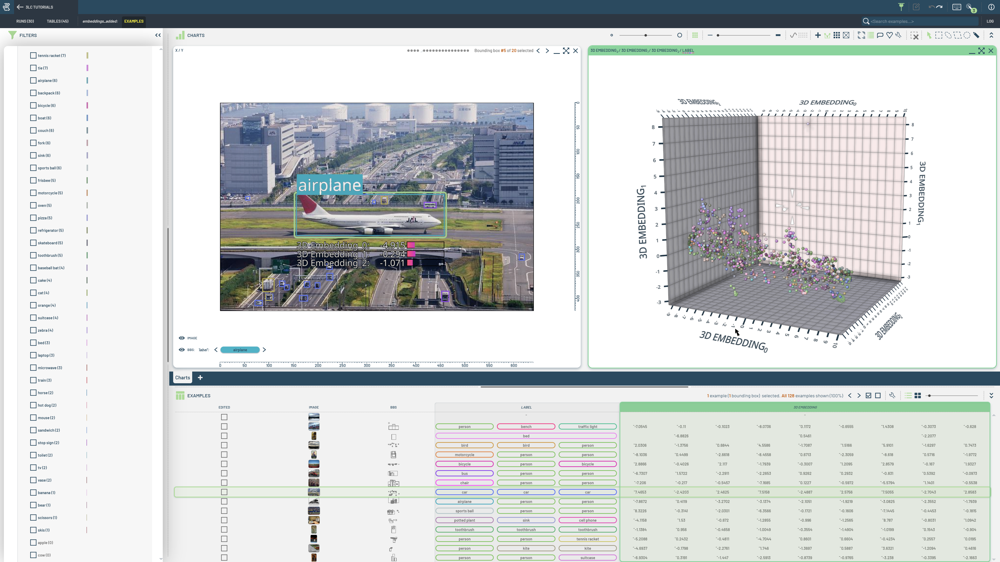

# Advanced Examples

This folder contains notebooks demonstrating how to work with Runs and metrics in 3LC.

|  |  |  |
|:----------:|:----------:|:----------:|
| **Bounding Box Embeddings** |
|  |
| These notebooks cover training a bounding box classifier, and then adding per-bounding-box embeddings to the initial table |||
