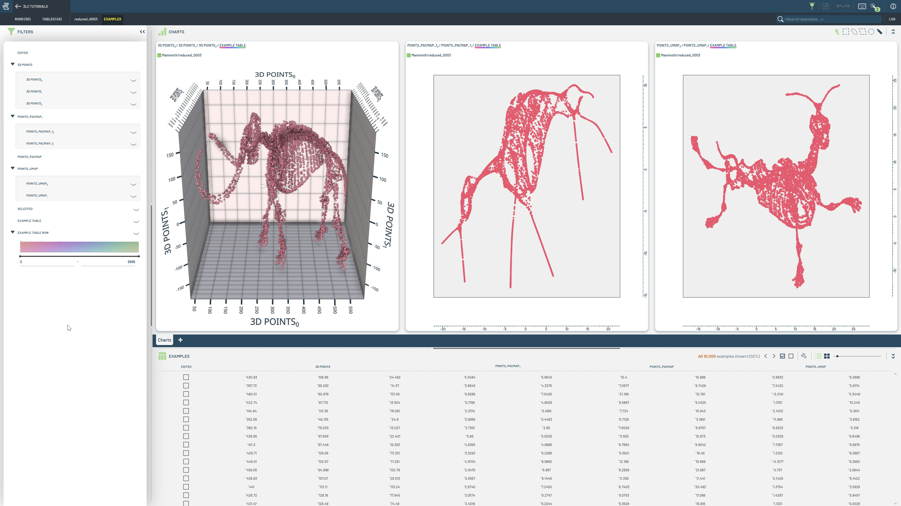
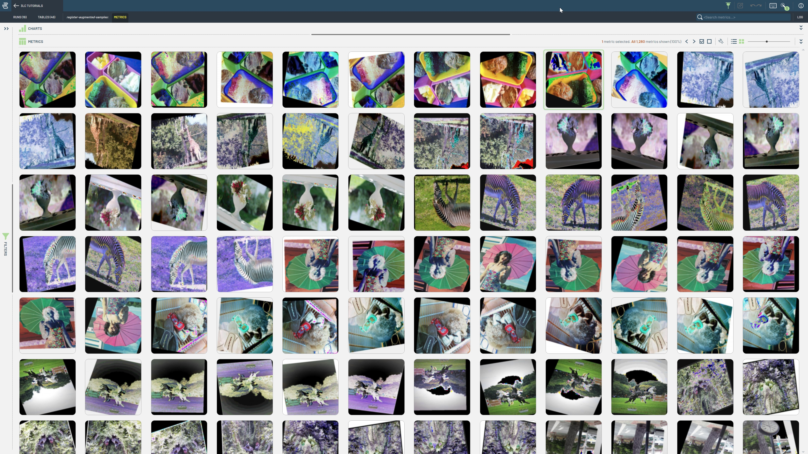

# Miscellaneous

This section contains a collection of tutorials that don't fit into any of the other categories.

|  |  |  |
|:-----------:|:----------:|:----------:|
| **Dimensionality Reduction** | **View Augmented Samples** | |
|  |  | |
| Experiment with multiple parametrizations of dimensionality reduction algorithms on the same Table.  | Register augmented samples as on-the-fly metrics in a 3LC Run. | |
