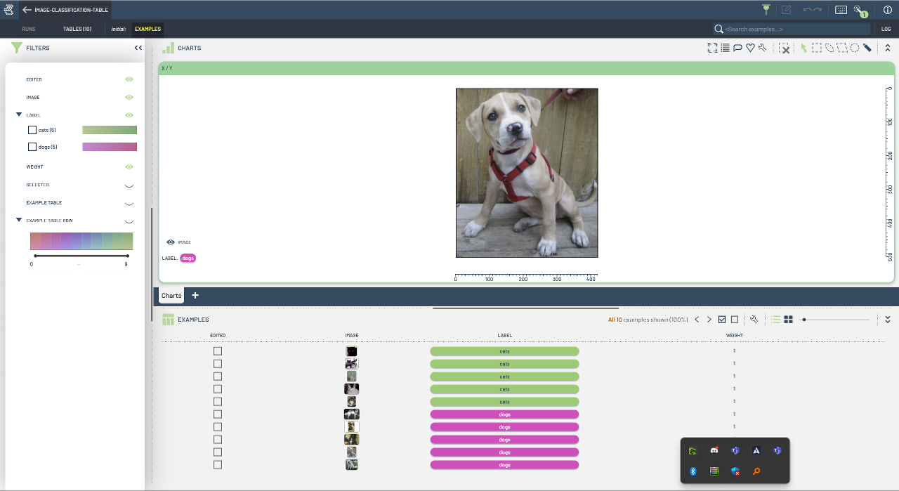
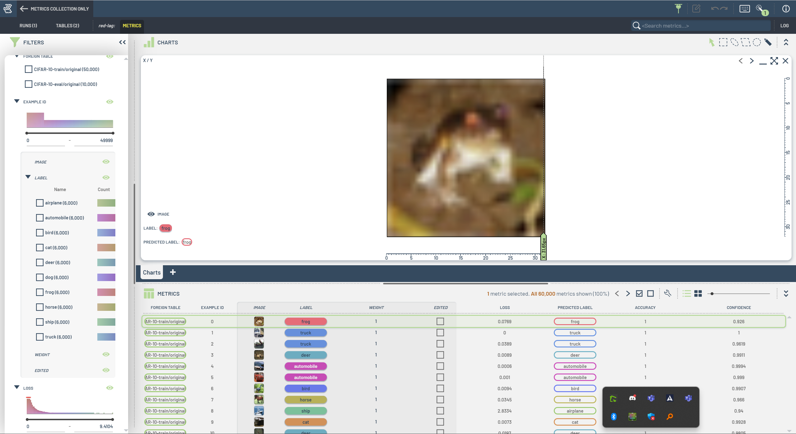
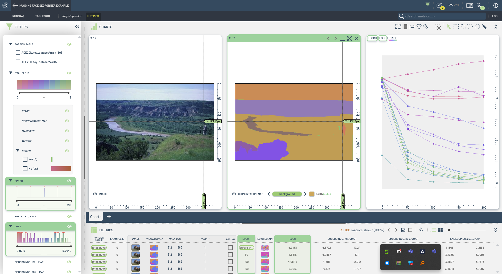
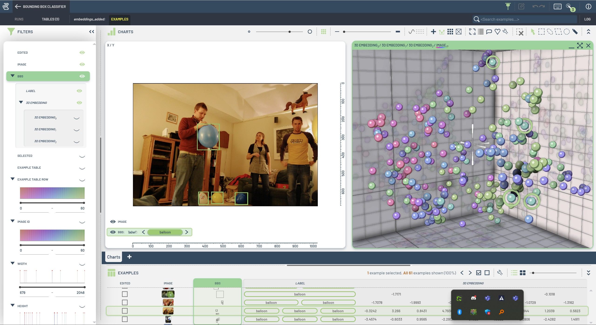
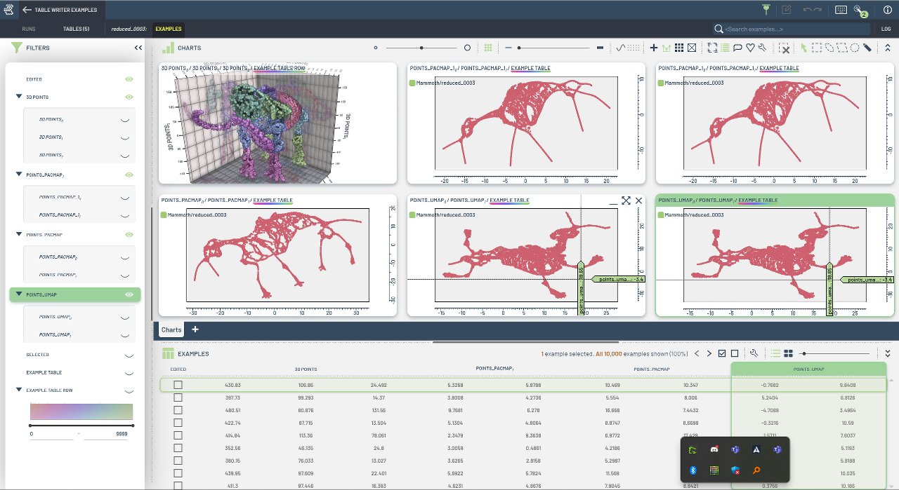

# Tutorials

This folder contains simple tutorials on how to get the most out of the `tlc` Python package. The tutorials are organized in a way that you can follow them step by step, starting from the basics and moving to more advanced topics. The notebooks are designed to be easily re-used and modified to fit your specific use case, in many cases by simply changing the input data.

The notebooks in the tutorials utilize the `tlc_tools` Python package as an additional helper library to simplify the code and make it easier to follow. Follow the installation instructions in the top-level README of this repository to get up and running.

|                          |                       |                                          |
|:------------------------:|:---------------------:|:----------------------------------------:|
| **1: Creating Tables** | **2: Modifying and Extending Tables** | **3: Training and Metrics Collection** |
|  |  |  |
| Learn how to create tables from various sources, introducing table schemas and covering the most common use cases. | Explore examples for modifying and extending tables, including splitting tables, adding new columns, and using the latest data. | Examples focused on metrics collection and runs. Introduces small, precise examples to gather and analyze model metrics. |
| **4: Complete Examples** | **5: Advanced Examples** | **6: Misc.** |
|  |  |  |
| Full examples of training and evaluation, showcasing integrations with frameworks like Hugging Face and SAM. | Advanced tutorials, including working with bounding box embeddings, training on image crops, and enhancing datasets with embeddings. | Additional examples and utilities, covering tasks like writing augmented samples and flattening complex data structures. |
