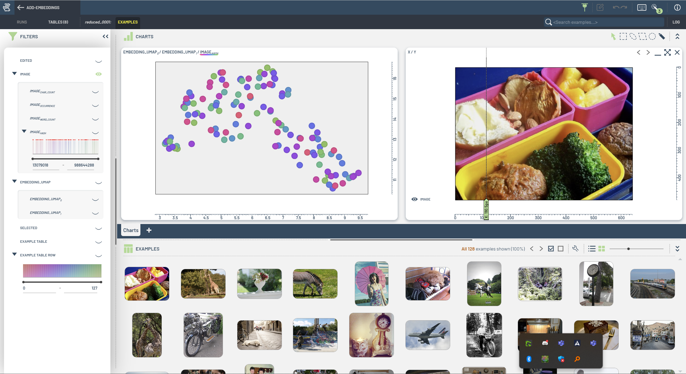

# Tutorials

This folder contains simple tutorials showcasing basic features of the `3lc` Python package.

| Level 0: Creating Tables | Level 1: Modifying and Extending Tables |
|--------------------------|-----------------------------------------|
|  |  |
| Learn how to create tables from various sources, introducing table schemas and covering the most common use cases. | Explore examples for modifying and extending tables, including splitting tables, adding new columns, and using the latest data. |

| Level 2: Training and Metrics Collection | Level 3: Complete Examples |
|------------------------------------------|----------------------------|
|  |  |
| Examples focused on metrics collection and runs. Introduces small, precise examples to gather and analyze model metrics. | Full examples of training and evaluation, showcasing integrations with frameworks like Hugging Face and SAM. |

| Level 4: Advanced Examples | Level 5: Misc. |
|----------------------------|----------------|
|  |  |
| Advanced tutorials, including working with bounding box embeddings, training on image crops, and enhancing datasets with embeddings. | Additional examples and utilities, covering tasks like writing augmented samples and flattening complex data structures. |

<!-- 
## Level 0: Creating Tables

Simple examples of creating tables from various sources.
Gently introduces the concept of schema.
Cover the most common use cases.

```
|-- create-table.ipynb
|-- create-table-from-coco.ipynb
|-- create-table-from-yolo.ipynb
|-- create-semantic-segmentation-table.ipynb
|-- create-bounding-box-table.ipynb
|-- create-image-classification-table.ipynb
|-- create-video-thumbnails-table.ipynb
```

## Level 1: Modifying and Extending Tables

Examples of modifying and extending tables. 
Create splits, add new columns, (get the latest?) etc.
(Each example could, if appropriate, contain several sub-examples.)


```
|-- split-table.ipynb
|-- add-image-metrics.ipynb
|-- add-embeddings.ipynb
|-- add-new-data-to-table.ipynb
|-- use-latest-table.ipynb
```

## Level 2: Training and Metrics Collection

Small, to-the-point examples of metrics collection.
Introduces the concept of runs and metrics.

```
|-- collect_metrics_only
|   |-- README.md
|   |-- collect_metrics_only.py
|   | requirements.txt
|-- train-classifier.ipynb
```

## Level 3: Complete Examples

Complete examples of training and evaluation. Includes examples of integrating with different frameworks (huggingface, sam, etc.)

```

|-- fine-tune-sam
|   |-- 1-create-sam-dataset.ipynb
|   |-- 2-fine-tune-sam.ipynb
|   | README.md

|-- huggingface-segmentation-example.ipynb
```

## Level 4. Advanced Examples

```
|-- bb-embeddings
|   |-- 1-fine-tune-on-crops.ipynb
|   |-- 2-collect-embeddings.ipynb
|   |-- 3-add-embeddings-to-table.ipynb
|   |-- 3b-add-embeddings-to-run.ipynb
```

## Level 5: Misc.

```
|-- write-augmented-samples.ipynb
|-- mammoth
|   |-- 1-write-mammoth-table.ipynb
|   |-- 2-flatten-mammoth.ipynb
|   | README.md
``` -->
